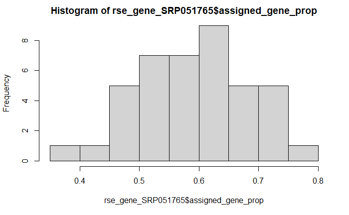
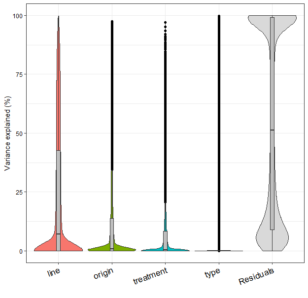
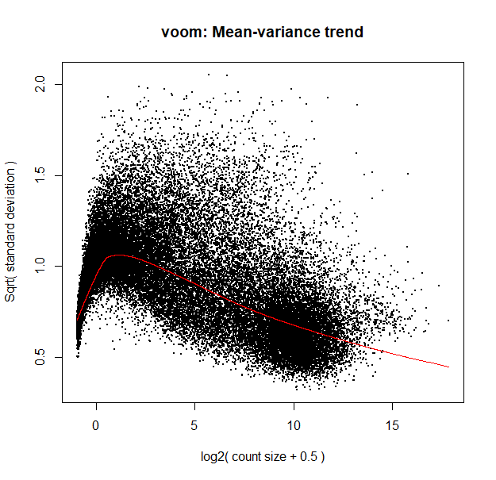
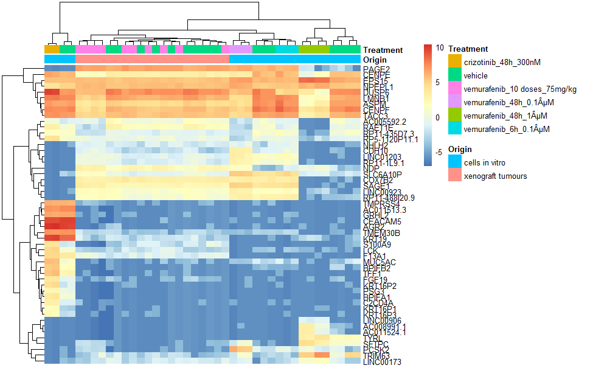
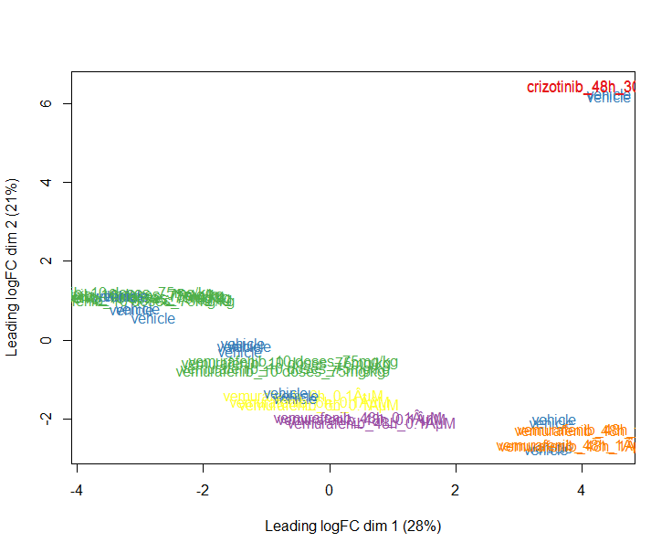
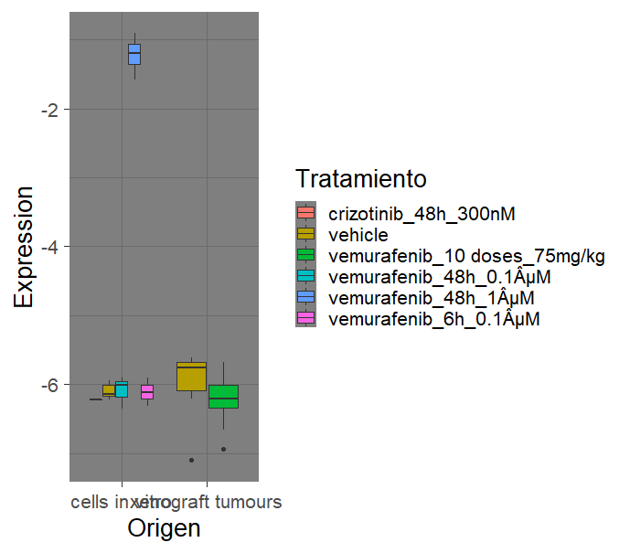

## Objetivo

El objetivo de este proyecto es realizar un analisis de expresion diferencial de modo que se pongan en práctica los conocimientos adquiridos durante el curso de RNA-seq 2022.

## Introducción

La resistencia a los medicamentos es un gran limitante de la eficacia de la terapia dirigida con inhibidores de kinasas contra el cáncer. Se ha descubierto que la terapia dirigida con inhibidores de BRAF, ALK o EGFR induce una red de señales secretadas en células de melanoma y adenocarcinoma de pulmón expuestas a fármacos. Este secretoma inducido por terapia (SIT) estimula el crecimiento, la infiltración y la metástasis de clones de cáncer resistentes a los medicamentos en el tumor.

## Analisis de Expresion

Para poder realizar el analisis de expresion diferencial lo primero que debemos hacer es importar las librerias necesarias.

```{R}
library("recount3")
library("edgeR")
library("variancePartition")
library("limma")
library("pheatmap")
library("RColorBrewer")
```

Una vez importadas las librerias es pertinente elegir los datos con los que vamos a trabajar y convertir las cuentas por nucleotido a cuentas por lectura.

```{R}
## Revisamos los proyectos con datos de humano en recount3
human_projects <- available_projects()

## Exploramos los proyectos disponibles en recount3
proj_info_interactive <- interactiveDisplayBase::display(human_projects)

## Verificamos que solo seleccionamos un renglón.
stopifnot(nrow(proj_info_interactive) == 1)

## Creamos el objeto RSE
rse_gene_SRP051765 <- create_rse(proj_info_interactive)

## Convertimos las cuentas por nucleotido a cuentas por lectura
assay(rse_gene_SRP051765,"counts") <- compute_read_counts(rse_gene_SRP051765)
```

```
## class: RangedSummarizedExperiment
## dim: 63856 36
## metadata(8): time_created recount3_version ...
## annotation recount3_url
## assays(2): raw_counts counts
## rownames(63856): ENSG00000278704.1
## ENSG00000277400.1 ...
## ENSG00000182484.15_PAR_Y
## ENSG00000227159.8_PAR_Y
## rowData names(10): source type ... havana_gene
## tag
## colnames(36): SRR7268163 SRR7268164 ...
## SRR7268197 SRR7268198
## colData names(175): rail_id external_id ...
## recount_pred.curated.cell_line BigWigURL
```

Una vez que hemos descargado los datos debemos rectificar que no haya anomalias que nos impidan trabajar, posteriormente expandimos la información.

```{R}
## Tras analizar los sample_attributes pudimos observar que no hay ningun
##problema con los datos
rse_gene_SRP051765$sra.sample_attributes[sample(1:41,size = 3)]

## Expandimos la informacion
rse_gene_SRP051765 <- expand_sra_attributes(rse_gene_SRP051765)

colData(rse_gene_SRP051765)[
  ,
  grepl("^sra_attribute", colnames(colData(rse_gene_SRP051765)))
]
```

Una vez expandida la informacion la preparamos para poder continuar con el workflow y buscamos diferencias entre las muestras generadas in vitro y aquellas generadas con un modelo de xenoinjerto

```{R}
## Pasamos de character a factor
rse_gene_SRP051765$sra_attribute.drug_treatment <- factor(rse_gene_SRP051765$sra_attribute.drug_treatment)

rse_gene_SRP051765$sra_attribute.origin <- factor(rse_gene_SRP051765$sra_attribute.origin)

## Resumen de las variables de interés
summary(as.data.frame(colData(rse_gene_SRP051765)[
  ,
  grepl("^sra_attribute.[drug_treatment|source_name|origin]", colnames(colData(rse_gene_SRP051765)))
]))

## Buscamos diferencias entre las muestras generadas in vitro y las muestras obtenidad de un modelo de xenoinjerto
rse_gene_SRP051765$origen <- factor(ifelse(rse_gene_SRP051765$sra_attribute.origin == "cells in vitro", "in_vitro", "xenoinjerto"))

table(rse_gene_SRP051765$origen)

rse_gene_SRP051765$assigned_gene_prop <- rse_gene_SRP051765$recount_qc.gene_fc_count_all.assigned / rse_gene_SRP051765$recount_qc.gene_fc_count_all.total

with(colData(rse_gene_SRP051765), tapply(assigned_gene_prop, origen, summary))
```

```
$in_vitro
   Min. 1st Qu.  Median    Mean 3rd Qu.    Max. 
 0.4170  0.4841  0.5707  0.5647  0.6189  0.6952 

$xenoinjerto
   Min. 1st Qu.  Median    Mean 3rd Qu.    Max. 
 0.3886  0.5800  0.6332  0.6297  0.7149  0.7526 
```

El siguiete paso que se debe realizar es analizar los datos para eliminar muestras de mala calidad, en este caso se encontró que para poder eliminar dos muestras se necesitaría un umbral alto.

```{R}
## Analizamos los datos para ver si eliminaremos muestras de mala calidad
hist(rse_gene_SRP051765$assigned_gene_prop)

table(rse_gene_SRP051765$assigned_gene_prop > 0.4)

table(rse_gene_SRP051765$assigned_gene_prop > 0.45)
```



Continuamos con la normalización de nuestros datos

```{R}
## Normalizamos los datos
dge <- DGEList(
  counts = assay(rse_gene_SRP051765, "counts"),
  genes = rowData(rse_gene_SRP051765)
)

dge <- calcNormFactors(dge)
```

Una vez normalizados nuestros datos debemos definir el modelo que emplearemos, en este caso lo primero que se hizo es utilizar la función ``fitExtractVarPartModel`` para observar como influyen las distintas variables en la expresion de los genes.

```{R}
## Definimos nuestro modelo
datos <- data.frame(
 "treatment" = rse_gene_SRP051765$sra_attribute.drug_treatment,
 "origin" = rse_gene_SRP051765$sra_attribute.origin,
 "line" = rse_gene_SRP051765$sra_attribute.cell_line,
 "type" = rse_gene_SRP051765$sra_attribute.cell_type
 )

design <- model.matrix( ~ origin, datos)

vobjGenes <- voom(dge, design)

formula <- ~ (1|line) + (1|type) + (1|treatment) + (1|origin)

var_exp<- fitExtractVarPartModel( vobjGenes, formula, datos )

plotVarPart(var_exp)
```

En este caso observamos que la linea celular es una parte importante de la variación en la expresión de los genes, sin embargo se decidió no incluir esta variable en el modelo pues sabemos que distintas líneas celulares expresan genes de maneras distintas por lo que dicha variación se debe más a las diferencias entre las células y no a las diferencias en el tratamiento.



```{R}
modelo <- model.matrix(~ sra_attribute.origin + sra_attribute.drug_treatment,
                    data = colData(rse_gene_SRP051765)
)

```

Comenzamos con el analisis de la expresion de los genes

```{R}
## Comenzamos con el analisis de expresion
vGene <- voom(dge, modelo, plot = TRUE)

eb_results <- eBayes(lmFit(vGene))

de_results <- topTable(
  eb_results,
  coef = c(3,4,5,6,7),
  number = nrow(rse_gene_SRP051765),
  sort.by = "none"
)
```



Ahora vemos cuantos genes estan realmente diferencialmente expresados

```{R}
## contamos los genes diferencialmente expresados entre los distintos tratamientos
table(de_results$adj.P.Val < 0.05)
```

```
FALSE  TRUE 
47477 16379 
```

Creamos un heatmap de los 50 genes más diferencialmente expresados

```{R}
## Agregamos los nombres de los 50 genes mas diferencialmente expresados
exprs_heatmap <- vGene$E[rank(de_results$adj.P.Val) <= 50, ]

nombres_heatmap <- rownames(exprs_heatmap)

rownames(exprs_heatmap) <- rowRanges(rse_gene_SRP051765)$gene_name[
  match(rownames(exprs_heatmap), rowRanges(rse_gene_SRP051765)$gene_id)
]

## Creamos una tabla con información de las muestras
## y con nombres de columnas mas faciles de leer
df <- as.data.frame(colData(rse_gene_SRP051765)[, c("sra_attribute.origin", "sra_attribute.drug_treatment")])
colnames(df) <- c("Origin", "Treatment")

## Hacemos el heatmap
pheatmap(
  exprs_heatmap,
  cluster_rows = TRUE,
  cluster_cols = TRUE,
  show_rownames = TRUE,
  show_colnames = FALSE,
  annotation_col = df
)
```



Hacemos multidimensional scaning

```{R}
## Convertimos los  los tratamientos a colores
col.Treatment <- df$Treatment

levels(col.Treatment) <- brewer.pal(nlevels(col.Treatment), "Set1")

col.Treatment <- as.character(col.Treatment)

## MDS por tratamiento
plotMDS(vGene$E, labels = df$Treatment, col = col.Treatment)
```



Ahora hacemos una gráfica para el gen mas diferencialmente expresado

```{R}
## Hacemos una grafica para el gen mas expresado diferencialmente
i <- which.min(de_results$P.Value)

df_temp <- data.frame(
  Expression = vGene$E[i,],
  Tratamiento = rse_gene_SRP051765$sra_attribute.drug_treatment,
  Origen = rse_gene_SRP051765$sra_attribute.origin
)

ggplot(df_temp, aes(y = Expression, x = Origen, fill = Tratamiento)) +
  geom_boxplot() +
  theme_dark(base_size = 20)

```



## Conclusiones 

Podemos concluir que Bioconductor provee una serie bastante robusta de paquetes para realizar analisis de expresión, entre ellos destacan ``recount3`` que nos permite bajar datos de una gran cantidad de experimentos, así como ``variancePartition`` que nos brinda las herramientas necesarias para definir el modelo que emplearemos. De la misma manera podemos concluir que si bien la gran cantidad de paquetes disponibles facilitan el análisis de los datos, cada set tiene sus propias dificuiltades como podrían ser la baja cantidad de muestras o la mala calidad de estas.

## Referencias

+ Collado-Torres, L. (2022). 5 Modelos estadísticos | Intro RNA-seq LCG-UNAM 2022. Retrieved 14 February 2022, from https://lcolladotor.github.io/rnaseq_LCG-UNAM_2022/modelos-estad%C3%ADsticos.html#espec%C3%ADficaciones-del-proyecto

+ RNA-seq analysis is easy as 1-2-3 with limma, Glimma and edgeR. (2022). Retrieved 14 February 2022, from http://bioconductor.org/packages/release/workflows/vignettes/RNAseq123/inst/doc/limmaWorkflow.html#unsupervised-clustering-of-samples

+ SPEAQeasy bootcamp. (2022). Retrieved 14 February 2022, from http://research.libd.org/SPEAQeasy-example/bootcamp_intro#4_Day_2

+ variancePartition. (2022). Retrieved 14 February 2022, from https://bioconductor.org/packages/release/bioc/vignettes/variancePartition/inst/doc/variancePartition.pdf
